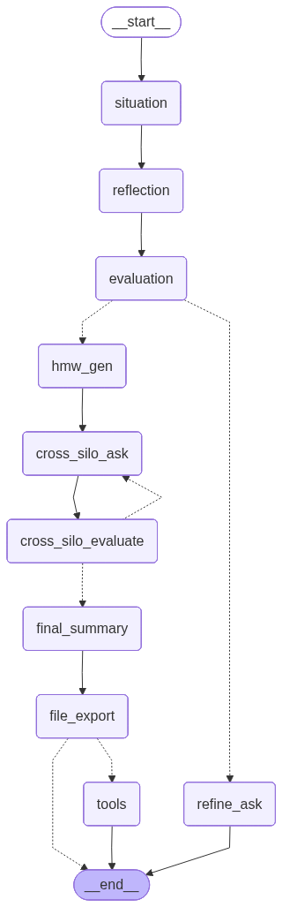

# AI Strategic Consultant Agent (AI 策略顧問)

> 專為主管設計的策略 Agent，運用 LangGraph 建構複雜認知流，模擬頂尖顧問的思考框架。

## 🌟 專案概述 (Overview)

本專案旨在打造一個具備「破框思維」的 AI 策略顧問。不同於一般的聊天機器人，此 Agent 透過嚴謹的思考流程（Workflow），引導使用者從表層痛點深入挖掘核心問題，利用「梯級分析法」定義目標，並進行跨部門（Cross-Silo）的可行性評估，最終產出具體的策略報告與簡報。

## 💡 Prompt 設計思路 (Design Philosophy)

本專案的核心 Prompt 設計採用了哥倫比亞大學教授Sheena Iyengar **《破框思維的技術》** 中的方法論：
1.  **痛點與目標挖掘**：不直接回答問題，而是先協助使用者釐清真實的痛點與目標。
2.  **梯級分析法**：透過層層提問，從廣泛的問題逐步聚焦到具體可行的策略。
3. **評分標準**：採用多維度評分機制，確保不是把解決方案當問題，而是聚焦在「解決正確的問題」。
## 🧠 Agent 核心流程 (Agent Workflow)


採用 **LangGraph** 進行狀態管理與路由控制，主要邏輯包含：
*   **條件式路由 (Conditional Routing)**
- 根據 `Evaluation` 節點的評分結果，決定是否進入下一階段或退回 `Refine Ask` 進行追問。
- 在 `Reflection` 與 `Cross-Silo` 階段，若資訊不足或評分未達標（如 < 65 分），會自動循環提問，直到品質達標。

### 節點功能說明 (Node Descriptions)

本系統由多個專職節點協作完成任務：

1.  **situation**: **局勢感知**
    *   收集職稱、當前痛點與預期目標，建立初始問題輪廓。
2.  **reflection**: **找缺失資訊**
    *   偵測缺失資訊，確保後續分析有足夠的上下文。
3.  **evaluation**: **品質評估**
    *   多面向評估資訊的完整性與深度，擔任「守門員」，決定資訊是否足夠進入策略生成階段，或需要進一步追問。
4.  **refine_ask**: **深度追問**
    *   當評估未通過時觸發，針對缺失的部分向主管提出具體的追問問題。
5.  **hmw_gen**: **how might we 定義問題**
    *   根據收集到的完整資訊，生成「我們如何...」的問題語句，引導出具策略性的思考方向。
6.  **cross_silo_ask**: **跨部門視角**
    *   確認所需跨部門的資源，確保策略全面性。
7.  **final_summary**: **策略總結**
    *   整合所有對話內容與分析結果，生成具體、可行且結構化的策略報告。
8.  **LLM tool**: **匯出策略報告**
    * 生成pptx格式的策略簡報，方便主管直接使用。

## 🛠 技術選型 (Tech Stack)

*   **Agent 框架**: `LangGraph`
    - 適合構建企業級 Workflow。
    - 支援條件判斷(conditional routing)、中斷重試 (Human-in-the-loop) 以及複雜的循環流程控制，比單純的 Chain 更靈活穩定。
*   **LLM 介面**: `LangChain` & `OpenAI` 
*   **前端介面**: `Streamlit`
    *   **選型原因**：快速構建互動式介面，便於展示對話流與狀態。
*   **套件管理**: `uv`

## 📂 資料夾架構設計 (Folder Structure)

```text
src/
├── nodes/          # 放置各個思考節點的實作邏輯
├── graph.py        # 定義 Workflow (LangGraph 的節點與邊)
├── state.py        # 定義狀態管理邏輯 (State Schema)
├── tool.py         # LLM 工具定義
├── llm.py          # LLM 配置與調用封裝
├── config.py       # LLM 與環境設定檔
└── logger.py       # 日誌記錄模組
app.py              # Streamlit 應用程式入口
README.md           # 專案說明文件
```

## 🚀 如何安裝與執行 (Installation)

```bash
# Initialize project (if starting from scratch)
uv init agent 

# Prepare environment (sync dependencies from pyproject.toml)
uv sync 

# Run the Streamlit application
uv run streamlit run app.py 
```

---
*Created by Annie Huang*


